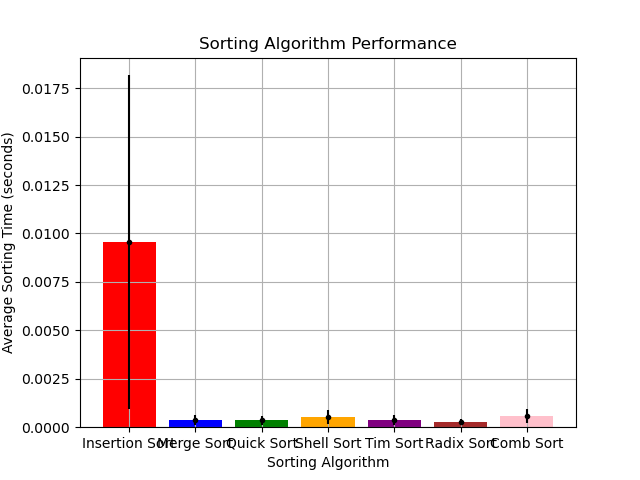

# Benchmark Test for Sorting Algorithms

This benchmark test is designed to evaluate and compare the execution time of various sorting algorithms implemented in the C programming language. The purpose is to provide a performance analysis of different sorting algorithms under varying input sizes.

## Table of Contents
- [Introduction](#introduction)
- [Sorting Algorithms Implemented](#sorting-algorithms-implemented)
- [Getting Started](#getting-started)
- [Usage](#usage)
- [Results](#results)
- [Possible Improvements](#possible-improvements)
- [Contributing](#contributing)


## Introduction

This benchmark test includes implementations of several sorting algorithms, allowing you to assess their performance in terms of execution time. The benchmark test is written in C and provides a flexible framework for comparing algorithms under different input scenarios.

## Sorting Algorithms Implemented

The following sorting algorithms are currently implemented in the benchmark test:
- Insertion Sort
- Merge Sort
- Quick Sort
- Shell Sort
- Radix Sort
- Tim Sort

## Getting Started
To run the benchmark test, follow these steps:

1. Clone the repository to your local machine:
   ```bash
   git clone https://github.com/prakhar479/sorting-algorithms-benchmark.git
   ```

2. Navigate to the project directory:
   ```bash
   cd sorting-algorithms-benchmark
   ```

3. Build the benchmark executable:
   ```bash
   make
   # alternatively
   make all
   ```
   This will generate an executable named `benchmark` in the project directory.

## Usage

Run the benchmark test by executing the generated executable with the desired parameters. The basic syntax is as follows:

```bash
./benchmark <input_size> <iterations> <algorithm>
```

- `<algorithm>`: Specify the sorting algorithm to test (e.g., bubble, insertion, selection, merge, quick).
- `<input_size>`: Specify the size of the input array for testing.
- `<iterations>`: Specify the number of iterations to run the test.

Default values are set to 1000 for input size and 10 for iterations, and benchmark will run all the implemented sorting algorithms if no algorithm is specified.

Following is the list of available sorting algorithms:
- `1` : Insertion Sort
- `2` : Merge Sort
- `3` : Quick Sort
- `4` : Shell Sort
- `5` : Tim Sort
- `6` : Radix Sort
- `7` : Comb Sort

Any other value will return an error message.

Example:
```bash
./benchmark 10000 10 2
```

This command will run the Quick Sort algorithm on an input array of size 10,000 and sample 10 itterations for average result and report the average execution time per sort.

Makefile as a part of the project provides following options:
- `make clean` : Remove the generated executable and object files and other temporary files.
- `make clean-results` : Remove the generated results and performance graphs.
- `make clean-all` : Remove the generated executable, object files, temporary files, results and performance graphs.
- `make all` : Build the benchmark executable.
- `make results MAX_INPUT_SIZE ITERATIONS STEP` : Generate performance graphs and tables from the benchmark results. This has optional parameters 'MAX_INPUT_SIZE', 'ITERATIONS' and 'STEP' to specify the maximum input size, iterations and step size for input sizes to be considered for generating the performance graphs and tables. Default values are set to 10000 for input size ,100 for iterations and 100 for step size.

Also feel free to modify the implementation of the sorting algorithms in the `sorting_routines` directory and add your own sorting algorithms to the benchmark test.

Note: Most of the sorting algorithms are implemented in the `sorting_routines` directory use Insertion Sort as a fallback for small input sizes. You can modify the threshold for small input sizes in the `(sorting_routine)/(sorting_routine).h` file.


## Results

The benchmark test will display the execution time of the selected sorting algorithm for the given input size. The results will help you compare the efficiency of different algorithms under various scenarios.

The results are also used to generate performance graphs and tables, which can be found in the `results` directory on running the `make results` command.

Here are some sample performance graphs and tables generated from the benchmark results:

Linear Plot of runtime vs input size:


Logarithmic Plot of runtime vs input size:


Aggregated Plot of runtime vs input size:


## Possible Improvements
- Add more sorting algorithms.
- Add more performance analytics for benchmarking.
- Multi-threading support for benchmarking for faster benchmarking

## Contributing
Contributions are welcome. Please feel free to open an issue or submit a pull request with your improvements.

---
